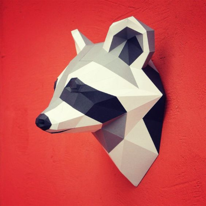

# POECAHONTAS

Le Musk du raton laveur l'emporte sur la sueur investie dans ce projet





## Installation

A completer

```bash
  ./mvn create all
  ;) enjoy
```
    
## API Reference du back

#### Get all items

```http
  GET /api/items
```

| Parameter | Type     | Description                |
| :-------- | :------- | :------------------------- |
| `api_key` | `string` | **Required**. Your API key |

#### Get item

```http
  GET /api/items/${id}
```

| Parameter | Type     | Description                       |
| :-------- | :------- | :-------------------------------- |
| `id`      | `string` | **Required**. Id of item to fetch |


## Documentation

[Documentation](https://linktodocumentation)

